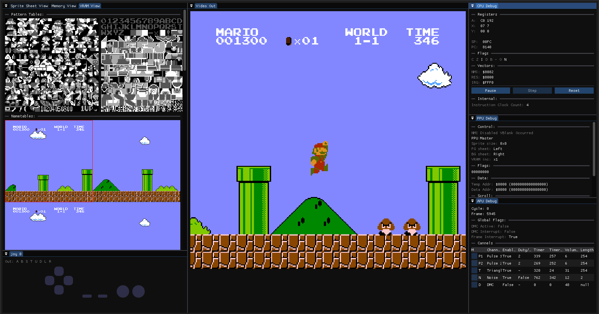
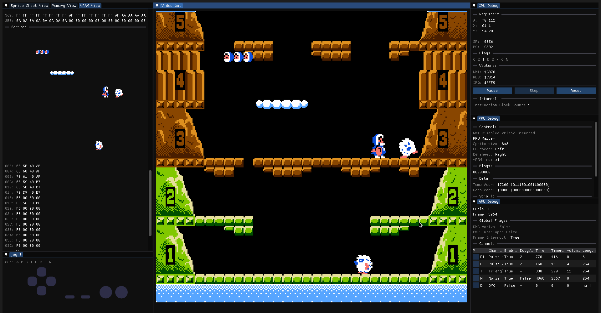

# NES Emulator

Nintendo Entretainment System emulator implemented in C#

The software provides hardware information such as memory view, PPU, CPU and ALU debug
and Joy-1 input. it also implements hardware accelerated graphics with OpenGL.

Supported mappers:
- NROM (no extra RAM)

